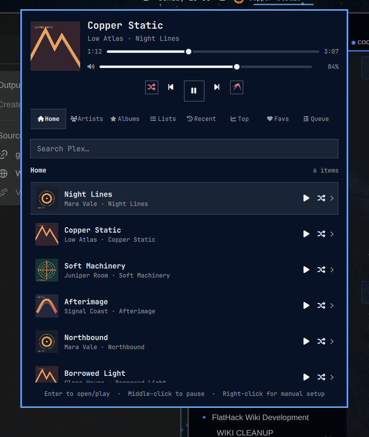

# Tunarchy

An unofficial native Omarchy bar widget for browsing and playing music from a
Plex Media Server. Click the bar item to open a compact library browser and
player. Tunarchy is not affiliated with or endorsed by Plex, Inc.



## Features

- Plex browser sign-in — no token copying required
- Home, artists, albums, playlists, history, favorites, queue, and search
- Artist → album → track and playlist → track navigation
- Album/playlist play and shuffle actions
- Manageable queue with play, reorder, remove, and clear-upcoming actions
- Album cover in the bar and player, progress, seek, play/pause, previous, and next
- System output volume by default, with optional 0–130% local player volume
- Shuffle, repeat-all, and repeat-one
- MPRIS integration for hardware media keys and desktop media controls
- Plex Dashboard integration with live play, pause, progress, track, and stop updates
- Actionable offline, authentication, DNS, library, and server error states
- Lazy on-demand artwork loading, bounded private cache, and offline last-good data
- Native Omarchy/Quickshell styling with top, bottom, and vertical bar support
- Keyboard and mouse navigation
- Credential-free demo mode with fictional music
- No Python packages: the helper uses only Python's standard library
- Plex access stored outside the plugin in a mode-`0600` config file
- mpv IPC playback sends the Plex token as an HTTP header, keeping it out of
  process arguments, stream URLs, and MPRIS metadata

## Requirements

- Omarchy 4.0 or newer with the plugin-based shell
- Python 3.10 or newer
- mpv (`omarchy pkg add mpv`)
- mpv-mpris (`omarchy pkg add mpv-mpris`) for media keys and MPRIS
- A reachable Plex Media Server with a music library
- A Plex account that can access that server

## Install

```bash
omarchy plugin add https://github.com/flathack/omarchy-tunarchy.git --enable
```

The manifest suggests the center of the bar. Move it at any time with:

```bash
omarchy bar move io.github.flathack.tunarchy --section center
```

## Connect Plex

When the player is not connected, click **Connect with Plex**. Tunarchy asks for
the server URL, opens Plex's sign-in page in the browser, and waits for you to
approve the app. Your Plex password is entered only on Plex's website and is
never visible to the plugin.

The same flow is available from a terminal:

```bash
~/.config/omarchy/plugins/io.github.flathack.tunarchy/bin/tunarchy login
```

Enter the HTTPS base URL, for example `https://plex.example.net:32400`. Tunarchy
verifies TLS certificates and refuses to forward credentials across origins or
from HTTPS to HTTP redirects. Use a plain `http://` address only on a network
you trust or inside an encrypted tunnel such as Tailscale; the Plex token is
otherwise visible to devices that can observe that connection. If the server
has several music libraries, setup asks which one to use.

Right-clicking the bar widget retains an interactive manual token setup as a
recovery fallback. The token is read without echo and is never accepted as a
command-line argument. Plex documents that fallback in
[Finding an authentication token / X-Plex-Token](https://support.plex.tv/articles/204059436-finding-an-authentication-token-x-plex-token/).

Connection details are stored in:

```text
${XDG_CONFIG_HOME:-~/.config}/tunarchy/config.json
```

## Usage

- Left-click the bar item to open the player.
- Right-click it to reconfigure the Plex connection.
- Middle-click it to play or pause.
- Scroll over it to move to the previous or next track.
- Type in the panel to search Plex.
- Search terms are limited to 256 characters to keep helper and server requests bounded.
- Use the navigation rail to browse artists, albums, playlists, history,
  favorites, and the active queue.
- Click a collection to open it, or use its inline play/shuffle actions.
- Reorder or remove upcoming tracks in the Queue view. When playback is stopped,
  **Clear upcoming** clears the complete saved queue because there is no current track.
- Use Left/Right to switch library tabs when the search field is empty. While
  editing a query, those keys move the text cursor normally.
- Use Up/Down to select rows and Enter to open or play them.
- Use Ctrl+Enter to play a selected album or playlist and Shift+Enter to
  shuffle it; Shift+Enter queues a selected track next.
- In Queue, use Ctrl+Up/Down to move a track and Delete to remove it.
- Use Tab/Shift+Tab to reach sliders, transport controls, tabs, collection
  actions, and inline Queue actions. Enter or Space activates a focused button.
- Escape clears an active search, returns from a collection, or closes the
  panel. Ctrl+Space toggles play/pause from anywhere in the panel.
- Open help and settings with the tuna button in the upper-right corner or `F1`.
  Select **System** to control Omarchy's current audio output (the default), or
  **Plex** to change only Tunarchy's local mpv player volume. Press Escape to
  return to the player.
- Hardware media keys work through MPRIS while mpv is running.

The CLI is also useful for troubleshooting:

```bash
PLAYER="$HOME/.config/omarchy/plugins/io.github.flathack.tunarchy/bin/tunarchy"
"$PLAYER" doctor
"$PLAYER" status
"$PLAYER" health
"$PLAYER" library artists --limit 5
"$PLAYER" queue
```

## Configuration

Plugin settings are exposed through Omarchy's schema:

```bash
omarchy bar set io.github.flathack.tunarchy recentAlbumCount 30
omarchy bar set io.github.flathack.tunarchy libraryItemCount 150
omarchy bar set io.github.flathack.tunarchy volumeMode System
```

### Demo mode

Demo mode shows fictional data, never contacts Plex, and never starts mpv:

```bash
omarchy bar set io.github.flathack.tunarchy demoMode true --json
# Restore the real library afterwards:
omarchy bar set io.github.flathack.tunarchy demoMode false --json
```

## Updates and removal

```bash
omarchy plugin update io.github.flathack.tunarchy
"${XDG_CONFIG_HOME:-$HOME/.config}/omarchy/plugins/io.github.flathack.tunarchy/bin/tunarchy" shutdown
omarchy plugin remove io.github.flathack.tunarchy
```

The `shutdown` command reports the active session as stopped and terminates the
private mpv process. Removing the plugin intentionally leaves connection settings
and the size-limited artwork cache in place. To remove them too, move these folders
to the desktop trash:

```bash
gio trash "${XDG_CONFIG_HOME:-$HOME/.config}/tunarchy"
gio trash "${XDG_CACHE_HOME:-$HOME/.cache}/tunarchy"
```

## Development

Run the tests and the same manifest validation used during installation:

```bash
python3 -m unittest discover -s tests -v
node --test tests/test_model.js
omarchy plugin validate .
```

For local development, symlink the checkout and enable it:

```bash
ln -s "$PWD" "$HOME/.config/omarchy/plugins/io.github.flathack.tunarchy"
omarchy plugin enable io.github.flathack.tunarchy --section center
```

Plugin files normally reload after saving. If a change is not picked up, run:

```bash
omarchy-shell shell rescanPlugins
```

### Brand assets

The generated Tuna artwork is stored in four transparent PNG variants:

- `assets/tuna-brand.png` — cropped, 512-pixel detailed brand artwork
- `assets/tuna-ui-18.png` — 18-pixel smallest UI sprite variant
- `assets/tuna-ui-24.png` — 24-pixel bar and compact help button sprite
- `assets/tuna-ui-64.png` — 64-pixel keyboard-help header artwork

## Privacy and limitations

Library requests, cover downloads, audio streams, and playback timeline updates
go directly to the Plex server configured by the user. The browser sign-in
talks to `plex.tv`; no other third-party service is involved. See
[SECURITY.md](SECURITY.md) for credential handling details.

- Playback is local to this computer; this version does not remote-control a
  Plexamp client on another device.
- Audio uses the original Plex media part directly. Tunarchy does not currently
  request a transcoded stream.
- Playback queues are capped at 500 tracks. When a larger collection is started
  from a selected track, the queue continues from that track and wraps around.
- The plugin implements the Plex server endpoints used by current Plex music
  libraries. Plex does not publish these endpoints as a stable public SDK.

## License

MIT
